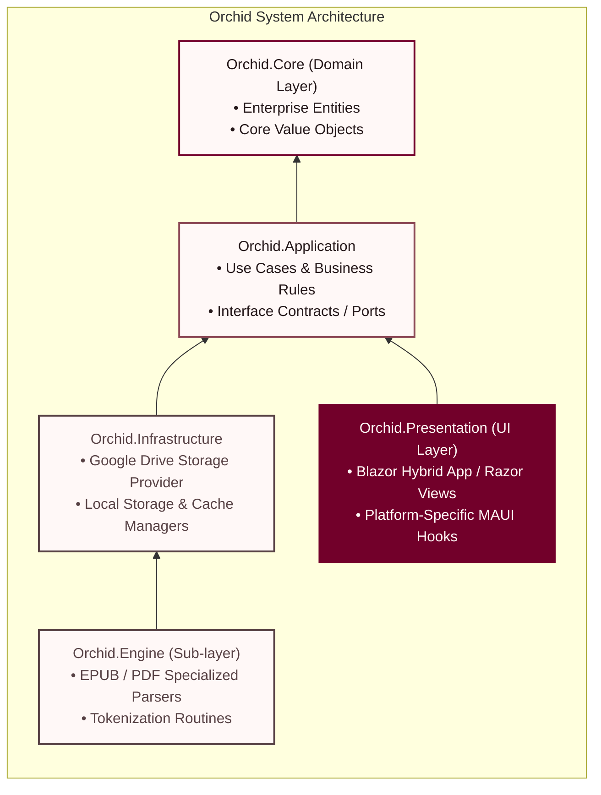
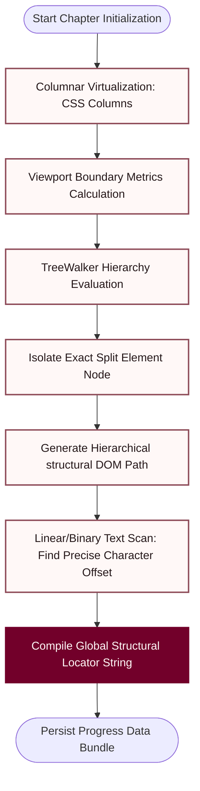

    

**Sync book reader on .NET MAUI Blazor Hybrid.**

Orchid is a modern, cross-platform e-book reader engineered with a 90% shared codebase between Mobile and Desktop platforms. Built upon **.NET MAUI** and **Blazor Hybrid**, Orchid provides a seamless reading experience powered by a decoupled **Clean Architecture**, localized offline parsing, and autonomous multi-device cloud synchronization.

---

## ✨ Overview

In a market dominated by closed, proprietary ecosystems (like Amazon Kindle or Apple Books), **Orchid** offers an open, vendor-independent alternative. It is designed for readers who want to control their own digital libraries while enjoying a seamless, synchronized reading experience across all their devices.

Whether you are reading on your smartphone during a commute or switching to your desktop at home, Orchid ensures you never lose your page.

**Key Features:**
* 📱 **True Cross-Platform:** A single, responsive UI built with Blazor that runs natively on Android, iOS, Windows, and macOS via MAUI.
* ☁️ **Bring Your Own Cloud (BYOC):** Sync your reading progress effortlessly using your personal **Google Drive**. No proprietary servers, no vendor lock-in.
* 📖 **Smart Adaptive Pagination:** A custom layout engine that reflows text perfectly across any screen size or font setting, preserving your exact reading position down to the character.
* ⚡ **Offline-First & Blazing Fast:** Aggressive local caching of metadata and pagination metrics allows for instantaneous library loading without re-parsing heavy EPUB or PDF files.
* 🛠️ **Developer Friendly:** Designed following strict Clean Architecture principles, making it incredibly easy to extend with new book formats or cloud providers.

---

## 🏗️ Architecture Overview

Orchid strictly adheres to the principles of **Clean Architecture** and the **Dependency Inversion Principle (DIP)**. This enforces an explicit direction of dependencies pointing inwards toward the enterprise business rules, rendering the core system entirely independent of UI frameworks, external cloud providers, and native layout engines.

### Architectural Subsystems:
* **Orchid.Core**: Encompasses pure domain objects (`Book`, `ReadingProgress`, `PageIdentifier`, `Locator`) devoid of external dependencies or infrastructure knowledge.
* **Orchid.Application**: Models business-use flows and houses critical workflow drivers like orchestrators, data transport objects (DTOs), and abstraction definitions.
* **Orchid.Infrastructure & Orchid.Engine**: Concretizes adapters for local disk persistence, handles resource serialization, and encapsulates isolated file parsers.
* **Orchid.Presentation**: Composes the user interface utilizing customizable Blazor views alongside target OS configurations (Android, Windows, etc.) using MAUI shell structures.

---

## 📑 Adaptive Pagination Algorithm

Orchid relies on an advanced, viewport-agnostic content layout pipeline. Unlike basic readers that rely on arbitrary, fixed screen cuts, Orchid abstracts the structural document layout into an immutable **Locator string format (`DOM Path:Character Offset`)**. This design ensures users maintain precise page positions across varying display sizes, font profiles, and row densities.

### Pagination Implementation Mechanics:
1.  **Columnar Virtualization**: The specialized reader view utilizes layout directives (`column-width: 100vw; column-gap: Xpx;`) to force standard vertical documents into a horizontally flowing virtual tape.
2.  **DOM Path Scanning**: Using a custom `TreeWalker` configuration filtered strictly to accept valid visual text blocks or graphic tags, the engine scans the document hierarchy to locate the exact nodes passing across the current visible canvas borders.
3.  **Offset Evaluation**: A range-bounded check scans characters sequentially surrounding the border junction via localized text rectangles metrics (`getClientRects()`). Once identified, the structural context is transformed into an explicit `Locator` string pattern: `1/1/0:42` (e.g., *Second sub-node -> Second child container -> First text node -> 42nd character offset*).

---

## ☁️ Autonomous Cloud Synchronization Flow

To deliver a reliable cross-device experience, Orchid incorporates a custom conflict resolution architecture communicating over the **Google Drive API v3 AppData folder**. Synchronization workflows execute inside platform-isolated background workers configured to secure transient resources during unstable network connectivity states.
